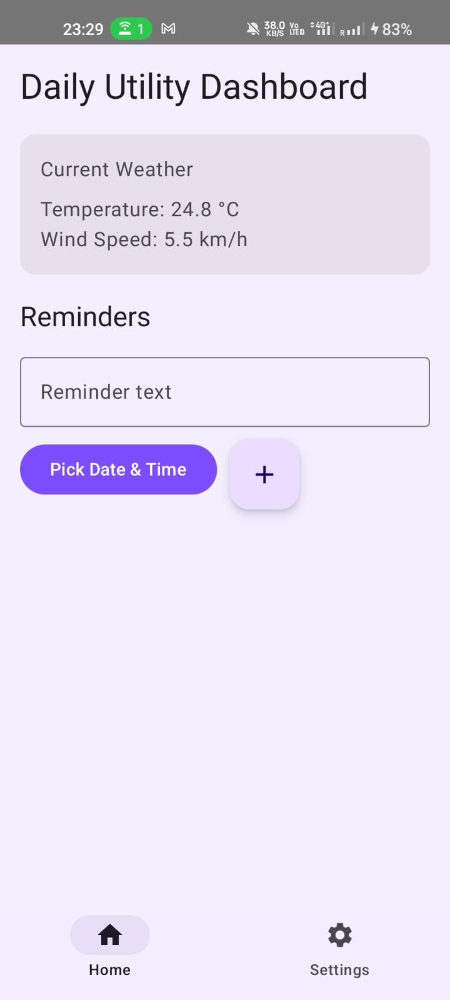
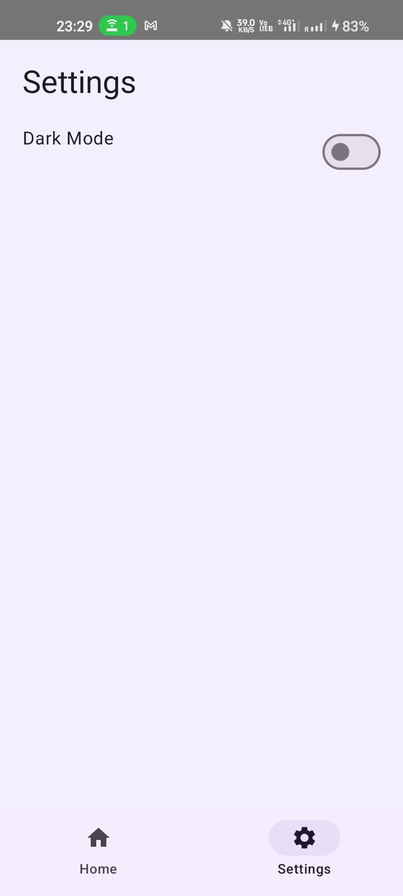
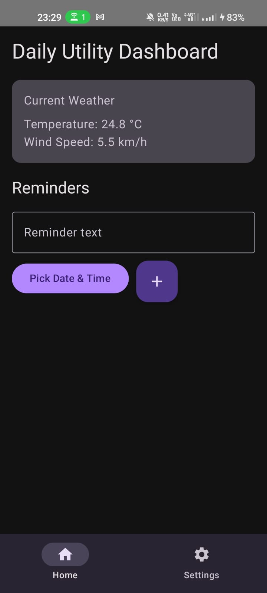

# Utility Hub

Utility Hub is a polished Android utility app built with Kotlin and Jetpack Compose. It combines a live weather snapshot for Singapore with simple local reminder scheduling in a clean, everyday mobile experience.

## Highlights

- Live weather card powered by the Open-Meteo API
- Reminder creation with date and time pickers
- Local reminder storage on the device
- Alarm-based reminder notifications
- Persistent light, dark, and purple appearance modes
- Material 3 UI with a custom launcher icon

## Screens

- **Home**: weather summary, reminder composer, and upcoming reminders
- **Settings**: appearance themes, notification notes, and app overview

## Tech Stack

- Kotlin
- Jetpack Compose
- Material 3
- MVVM-style view models
- Retrofit + Gson
- SharedPreferences local storage
- AlarmManager + BroadcastReceiver notifications

## Project Structure

```text
app/src/main/java/com/rahul/utilityapp
|-- data
|   |-- model
|   |-- remote
|   `-- repository
|-- ui
|   |-- home
|   |-- navigation
|   |-- settings
|   `-- theme
|-- utils
|-- viewmodel
|-- MainActivity.kt
`-- ReminderReceiver.kt
```

## Getting Started

1. Clone the repository
2. Open the project in Android Studio
3. Let Gradle sync finish
4. Run the app on an emulator or Android device

## Screenshots





## Notes

- Weather data comes from the public [Open-Meteo](https://open-meteo.com/) API
- Reminder data stays on-device using local storage
- Notification delivery depends on device notification permission settings on Android 13 and above
